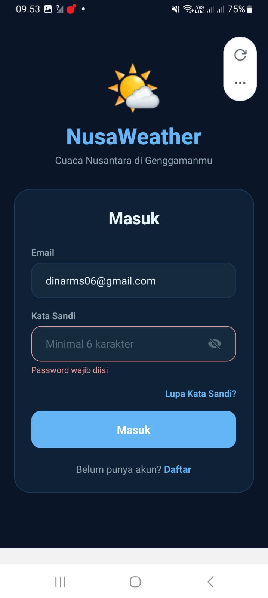
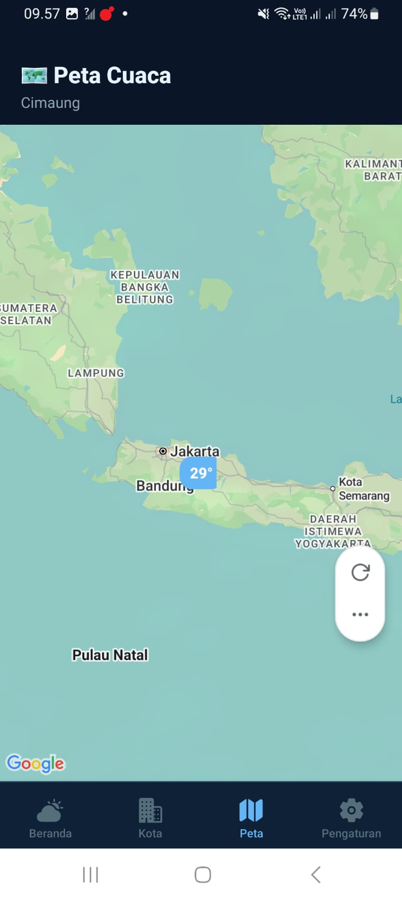
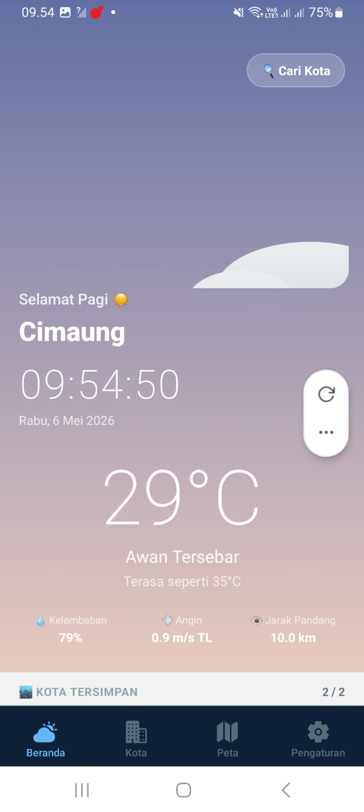
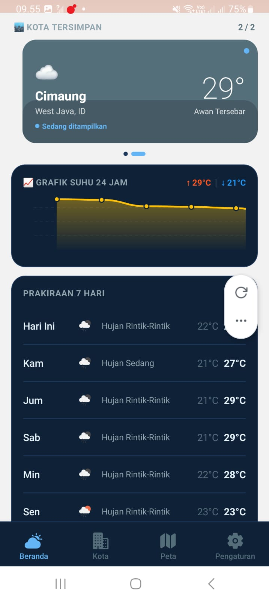
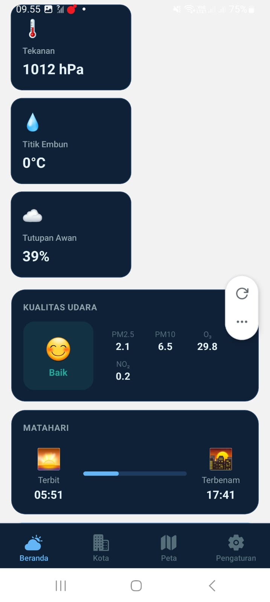
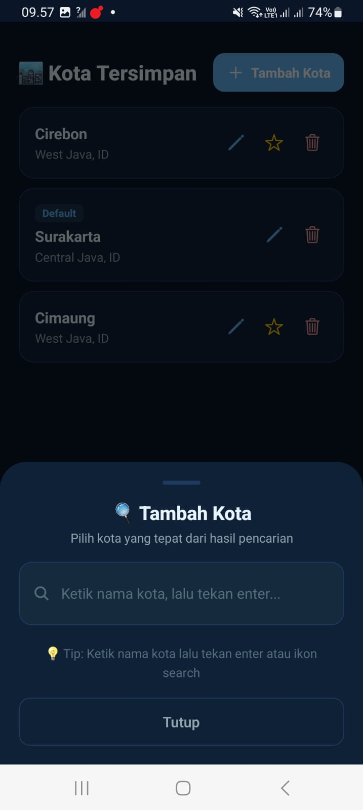
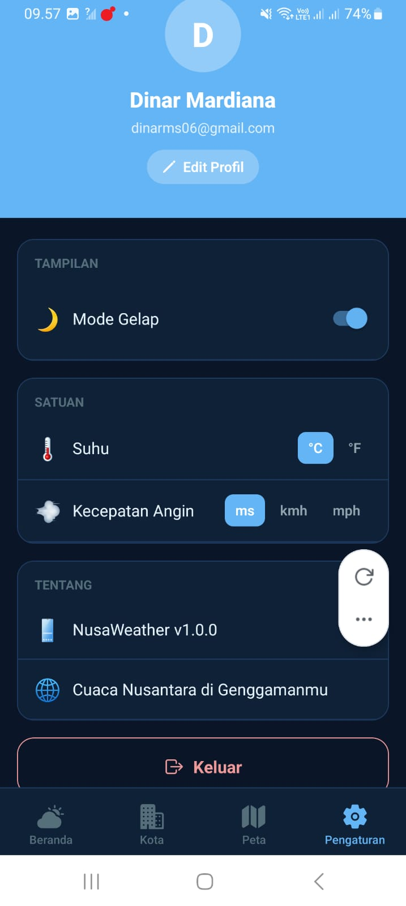

# 🌦️ NusaWeather

## 📱 Deskripsi Aplikasi
NusaWeather adalah aplikasi mobile berbasis React Native (Expo) yang digunakan untuk:
- Mengecek cuaca secara realtime berdasarkan nama kota
- Menyimpan data (seperti kota favorit atau catatan) ke database

Aplikasi ini dibuat sebagai tugas UTS Mobile Programming.

---

## 🚀 Fitur Utama

### 🔐 1. Authentication (Login & Register)
Pengguna dapat:
- Membuat akun baru (Register)
- Login menggunakan email dan password
- Logout dari aplikasi

Fitur ini menggunakan Firebase Authentication.

---

### 🗂️ 2. CRUD Data (Firestore)
Pengguna dapat mengelola data:
- ➕ Create → menambahkan data baru
- 📖 Read → melihat daftar data
- ✏️ Update → mengedit data
- ❌ Delete → menghapus data

Data disimpan secara online menggunakan Cloud Firestore.

---

### 🌦️ 3. Cek Cuaca Realtime
Pengguna dapat:
- Memasukkan nama kota
- Melihat informasi cuaca secara langsung seperti:
  - Suhu
  - Kondisi cuaca (cerah, hujan, dll)

Data diambil dari OpenWeather API.

---

## 🛠️ Teknologi yang Digunakan
- React Native (Expo)
- Firebase Authentication
- Cloud Firestore
- OpenWeather API (REST API)

---

## 📲 Cara Menjalankan Aplikasi

1. Clone repository:
   git clone https://github.com/Dmardiana/NusaWeather.git

2. Masuk ke folder project:
   cd NusaWeather

3. Install dependencies:
   npm install

4. Jalankan aplikasi:
   npx expo start

5. Scan QR menggunakan aplikasi Expo Go di HP

---

## 🖼️ Screenshot Aplikasi

### 🔐 Login

### 🏠 Home / Map

### 🌦️ Cek Cuaca

### 📊 Detail Cuaca

### 📊 Detail Cuaca 2

### 🗂️ CRUD Data

### ⚙️ Setting

## 🎥 Video Demo
Link video presentasi:
(Tambahkan link Google Drive / YouTube)

---

## 👨‍💻 Author
Dmardiana
